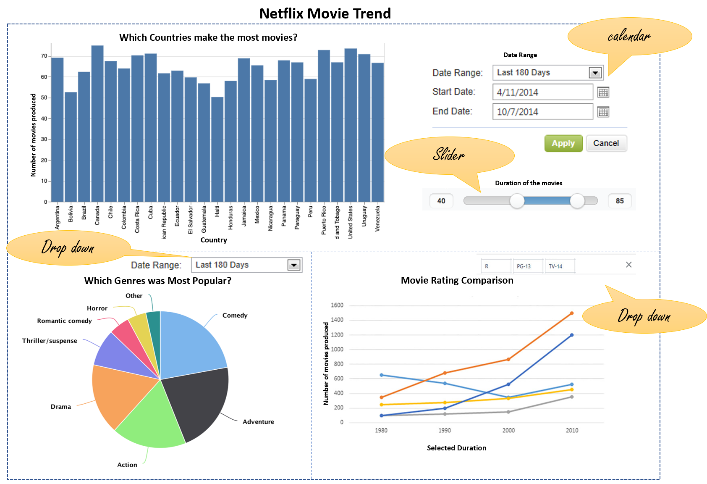

# Movie Dashboard

## Description of the app

Have you ever think about how many movies are produced in each country every year? how many of them categorized in each movie rating groups? what is the most populare genres among them? This data visualizatin app aims to give you this insight that what is going on in movie world in the countries?

The app contains a landing page with three key visualizations. A global filter of year located on the right handside of the menu, controls these plots. Each plot has its own filter as well. a dropdown menu allowing multi-selection of movie rating and a date range selector to narrow down genre results based on movie release date.

### 1. Country vs Movie count (Bar chart)

The user would be able to see a bar chart which depicts the number of movies belonging to a particular country in the selected period. They also can filter it based on duration of the movie to see which countries tend to produce longer movies. This can help the audience to get insight which countries spend more budget on movie intertainment market.

### 2. Genre popularity (Pie chart)

This pie chart would show the share of each genre in movie market. This would help the user answer the question - Which genres tend to be well received by audiences and would allow a the producers to make a more informed decision on the kind of movie to produce.

### 3. Release month vs Movie rating (Line chart)

The user would see a line plot depicting how the number of movies produced for particular rating has changed over time. This would help provide insights to answer the question "Do people have more tendency for specific movie rating in recent years?" for instance if PG has increasing trend and kids has decreasing, it shows audience are more into "Parental Guidance" content. This could help the production team make a more informed choice on what content should be or should not be in their movies, and when the demand is high for these movies to release their movie.

## App Sketch

